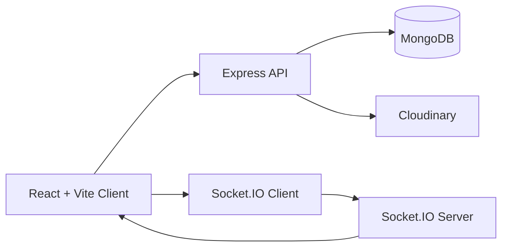

# DevConnector

A full-stack developer social network where users create profiles, share posts, upload images, and interact through real-time notifications.

## 🚀 Live Demo
Coming Soon

## 📌 Overview
DevConnector helps developers build a public identity around their skills, experience, and work history while staying active in a community feed. It is built as a portfolio-ready MERN application that combines authentication, profile management, media uploads, and real-time engagement in one project.

You can also review the backend API contract in [API.md](./API.md).

## ✨ Features
- Secure authentication with JWT access tokens, refresh-token rotation, HTTP-only cookies, and hashed passwords using `bcryptjs`
- Responsive landing, registration, and login flows with password validation, password visibility toggles, and toast-based feedback
- Developer profile creation and editing with status, bio, skills, company, location, website, GitHub username, and social links
- Avatar uploads and post image uploads powered by Cloudinary and Multer
- Experience and education management with add and delete actions
- Personalized dashboard with quick actions, profile completion prompts, skills preview, and account deletion
- Community post feed with text posts, optional images, like/unlike support, comments, timestamps, loading states, and empty states
- Real-time like and comment notifications using Socket.IO
- REST API support for profile follow/unfollow, followers/following lists, user suggestions, post CRUD operations, comment management, and pagination
- Backend validation, rate limiting, Helmet-based security headers, CORS handling, and automated frontend/backend tests

## 🛠️ Tech Stack
Frontend: React 18, Vite, React Router, Axios, React Hot Toast, Three.js, React Three Fiber

Backend: Node.js, Express 5, Socket.IO, JWT, bcryptjs, cookie-parser, Zod-based validation

Database: MongoDB, Mongoose

Media & Uploads: Cloudinary, Multer, multer-storage-cloudinary

Testing: Vitest, Testing Library, Jest, Supertest, mongodb-memory-server

## 🏗️ Architecture
DevConnector uses a split client/server architecture. The React app handles routing, forms, protected pages, and feed interactions, while the Express server exposes REST APIs, manages authentication, connects to MongoDB, handles Cloudinary uploads, and emits Socket.IO notifications for live activity updates.



## ⚙️ Getting Started

### Prerequisites
- Node.js 18 or newer
- npm
- MongoDB Atlas account or local MongoDB instance
- Cloudinary account for avatar and post image uploads

### Installation
```bash
git clone https://github.com/your-username/DevConnector.git
cd DevConnector
```

Install backend dependencies:

```bash
cd server
npm install
```

Install frontend dependencies:

```bash
cd ../client
npm install
```

### Environment Variables
Copy [server/.env.example](./server/.env.example) to `server/.env` and update the values:

```env
MONGO_URI=your_mongodb_connection_string
JWT_SECRET=your_jwt_secret
REFRESH_TOKEN_SECRET=your_refresh_token_secret
CLOUDINARY_CLOUD_NAME=your_cloudinary_cloud_name
CLOUDINARY_API_KEY=your_cloudinary_api_key
CLOUDINARY_API_SECRET=your_cloudinary_api_secret
CLIENT_URL=http://localhost:5173
PORT=5000
NODE_ENV=development
```

### Run Locally
Start the backend:

```bash
cd server
npm run dev
```

Start the frontend in a second terminal:

```bash
cd client
npm run dev
```

Open `http://localhost:5173`.

The Vite client proxies `/api` requests to `http://localhost:5000`, so both apps should be running during local development.

## 📸 Screenshots

### Landing Page


### Registration


### Dashboard


### Post Feed


## 🔑 Key Learnings
- Building a modern auth flow with short-lived access tokens, refresh cookies, silent refresh, and protected client routes
- Designing a modular Express API with validation, rate limiting, secure upload handling, and clear route separation
- Connecting React state, Axios interceptors, and Socket.IO to deliver a smoother real-time user experience
- Testing both frontend and backend flows with Vitest, Jest, Supertest, and an in-memory MongoDB setup

## 🚧 Future Improvements
- Complete the forgot-password and account recovery flow
- Connect the suggested developers sidebar to the live `/api/profile/suggestions` endpoint
- Add frontend controls for editing/deleting posts and browsing public developer profiles
- Deploy the client and server with CI/CD and a production-ready live demo

## 📄 License
This project is licensed under the MIT License. See [LICENSE](./LICENSE) for details.
